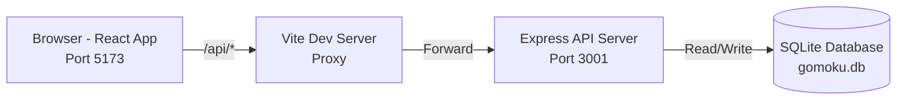
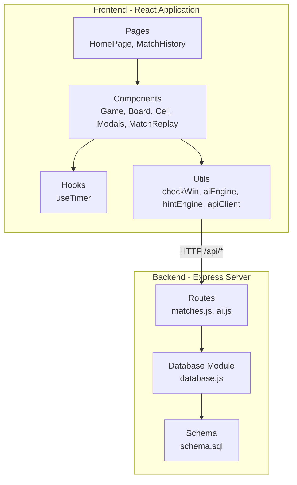
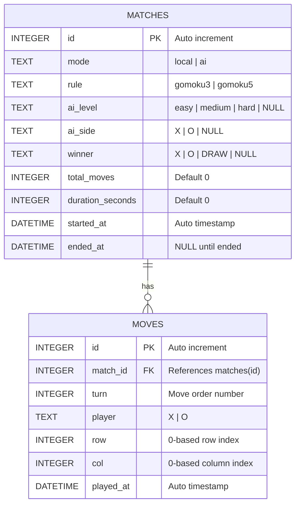

# BÁO CÁO ĐỒ ÁN PROJECT II

## PHÁT TRIỂN GAME GOMOKU VỚI AI NHIỀU CẤP ĐỘ VÀ CÁC CHẾ ĐỘ LUẬT CHƠI ĐA DẠNG

---

**Sinh viên thực hiện:** Nguyễn Nhật Linh — MSSV: 20236040

**Giảng viên hướng dẫn:** *(ghi tên giảng viên)*

**Bộ môn:** Công nghệ Phần mềm

**Học kỳ:** *(ghi học kỳ)*

---

## MỤC LỤC

- [Chương 1. Tổng quan đề tài](#chương-1-tổng-quan-đề-tài)
- [Chương 2. Cơ sở lý thuyết và công nghệ sử dụng](#chương-2-cơ-sở-lý-thuyết-và-công-nghệ-sử-dụng)
- [Chương 3. Phân tích và thiết kế hệ thống](#chương-3-phân-tích-và-thiết-kế-hệ-thống)
- [Chương 4. Triển khai hệ thống](#chương-4-triển-khai-hệ-thống)
- [Chương 5. Kiểm thử và đánh giá](#chương-5-kiểm-thử-và-đánh-giá)
- [Chương 6. Kết luận và hướng phát triển](#chương-6-kết-luận-và-hướng-phát-triển)
- [Tài liệu tham khảo](#tài-liệu-tham-khảo)

---

## Chương 1. Tổng quan đề tài

### 1.1. Đặt vấn đề

Gomoku (hay còn gọi là cờ caro) là một trò chơi chiến thuật hai người có nguồn gốc từ Nhật Bản, trong đó hai người chơi lần lượt đặt quân trên bàn cờ và người thắng là người đầu tiên xếp được một hàng liên tiếp đủ số quân quy định theo hàng ngang, dọc hoặc chéo. Trò chơi này có luật đơn giản nhưng chiều sâu chiến thuật cao, phù hợp cho mọi lứa tuổi và là một bài toán kinh điển trong lĩnh vực trí tuệ nhân tạo (AI).

Trong bối cảnh phát triển phần mềm hiện đại, việc xây dựng một ứng dụng web trò chơi Gomoku không chỉ đòi hỏi kiến thức về lập trình giao diện người dùng (frontend) và xử lý phía máy chủ (backend), mà còn yêu cầu hiểu biết sâu về các thuật toán tìm kiếm trong không gian trạng thái — đặc biệt là thuật toán Minimax và kỹ thuật cắt tỉa Alpha-Beta. Đây là những kiến thức nền tảng quan trọng trong ngành Khoa học Máy tính.

Xuất phát từ nhu cầu thực hành và tổng hợp kiến thức đã học, đồ án này hướng tới việc xây dựng một ứng dụng web chơi Gomoku hoàn chỉnh, tích hợp trí tuệ nhân tạo với nhiều cấp độ khó, hỗ trợ đa dạng luật chơi, và có khả năng lưu trữ lịch sử trận đấu.

### 1.2. Mục tiêu đề tài

Mục tiêu chính của đồ án là xây dựng một ứng dụng web chơi Gomoku với các yêu cầu cụ thể sau:

- **Gameplay hoàn chỉnh:** Cho phép hai người chơi trên cùng thiết bị (Local Multiplayer) hoặc người chơi đấu với AI. Hệ thống tự động kiểm tra điều kiện thắng, thua, hòa và quản lý lượt chơi.

- **Hệ thống AI ba cấp độ:** Triển khai ba mức độ AI (Easy, Medium, Hard) với chiến thuật tăng dần từ chọn ngẫu nhiên đến sử dụng thuật toán Minimax kết hợp Alpha-Beta pruning và heuristic evaluation.

- **Đa dạng luật chơi:** Hỗ trợ nhiều biến thể luật chơi với số quân liên tiếp để thắng khác nhau (3 quân trên bàn 3×3, 5 quân trên bàn 15×15), cho phép người chơi lựa chọn trước mỗi trận đấu.

- **Các tính năng nâng cao:** Hệ thống gợi ý nước đi (Smart Hint), đồng hồ đếm ngược mỗi lượt (Timer), tạm dừng/tiếp tục trận đấu (Pause/Resume), bảng tỉ số theo phiên chơi.

- **Lưu trữ và xem lại:** Kết nối cơ sở dữ liệu để lưu lịch sử trận đấu, thống kê kết quả, và cho phép xem lại (replay) từng trận đấu theo từng nước đi.

- **Giao diện hiện đại:** Xây dựng giao diện người dùng trực quan, thân thiện, có hiệu ứng động (animation) và thiết kế responsive phù hợp với nhiều kích thước màn hình.

### 1.3. Phạm vi đề tài

Đồ án tập trung vào phát triển ứng dụng web chạy trên trình duyệt, bao gồm hai phần chính: frontend (giao diện người dùng) và backend (xử lý dữ liệu và API). Hệ thống được thiết kế để chạy trên môi trường local development với khả năng mở rộng lên production.

Phạm vi không bao gồm: chơi trực tuyến giữa nhiều thiết bị (online multiplayer), hệ thống đăng nhập/đăng ký tài khoản, hoặc triển khai trên cloud server.

### 1.4. Kế hoạch thực hiện

Đồ án được thực hiện trong 13 tuần (Tuần 27 — Tuần 39), chia thành 4 milestone chính:

| Giai đoạn | Thời gian | Nội dung chính | Kết quả |
|-----------|-----------|----------------|---------|
| Milestone 0 | Tuần 27–29 | Xác định đề tài, thiết kế kiến trúc, khởi tạo project | Đề xuất đề tài, wireframe |
| Milestone 1 | Tuần 30 | Bàn cờ, đặt quân, kiểm tra thắng, highlight | Game local cơ bản |
| Milestone 2 | Tuần 31–33 | AI Easy/Medium, Smart Hint, Timer | Game với AI hoạt động |
| Milestone 3 | Tuần 34–36 | AI Hard, Multiple Rules, Pause System | Game gần hoàn chỉnh |
| Final | Tuần 37–39 | Match History, Database, kiểm thử, hoàn thiện | Hệ thống hoàn chỉnh |

---

## Chương 2. Cơ sở lý thuyết và công nghệ sử dụng

### 2.1. Lý thuyết trò chơi và Gomoku

Gomoku thuộc lớp trò chơi hai người, tổng bằng không (zero-sum game), thông tin đầy đủ (perfect information game). Trong lý thuyết trò chơi, đây là loại trò chơi mà cả hai người chơi đều biết toàn bộ trạng thái bàn cờ tại mọi thời điểm, không có yếu tố ngẫu nhiên.

Bàn cờ Gomoku tiêu chuẩn có kích thước 15×15 ô (tổng cộng 225 ô). Hai người chơi lần lượt đặt quân X và O lên các ô trống. Người thắng là người đầu tiên tạo được chuỗi 5 quân liên tiếp (hoặc số quân tùy biến thể) theo hàng ngang, dọc, hoặc đường chéo. Trận đấu kết thúc hòa khi toàn bộ bàn cờ được lấp đầy mà không có người thắng.

### 2.2. Thuật toán Minimax

Minimax là thuật toán tìm kiếm trong cây trò chơi (game tree), được sử dụng rộng rãi trong các trò chơi hai người. Ý tưởng cốt lõi: người chơi tối đa hóa (maximizer) luôn chọn nước đi có điểm cao nhất, trong khi đối thủ tối thiểu hóa (minimizer) luôn chọn nước đi có điểm thấp nhất.

Thuật toán hoạt động bằng cách xây dựng cây trạng thái từ trạng thái hiện tại đến một độ sâu (depth) nhất định, sau đó sử dụng hàm đánh giá heuristic để chấm điểm các trạng thái lá, rồi lan truyền ngược (backpropagation) giá trị lên gốc cây.

**Pseudocode của Minimax:**

```
function minimax(state, depth, isMaximizing):
    if depth == 0 or state is terminal:
        return evaluate(state)

    if isMaximizing:
        bestScore = -∞
        for each move in possibleMoves(state):
            score = minimax(apply(state, move), depth-1, false)
            bestScore = max(bestScore, score)
        return bestScore
    else:
        bestScore = +∞
        for each move in possibleMoves(state):
            score = minimax(apply(state, move), depth-1, true)
            bestScore = min(bestScore, score)
        return bestScore
```

### 2.3. Cắt tỉa Alpha-Beta (Alpha-Beta Pruning)

Alpha-Beta pruning là kỹ thuật tối ưu hóa thuật toán Minimax bằng cách loại bỏ các nhánh không cần thiết trong cây tìm kiếm. Kỹ thuật này duy trì hai giá trị:

- **Alpha (α):** Giá trị tốt nhất mà maximizer đã tìm được (cận dưới).
- **Beta (β):** Giá trị tốt nhất mà minimizer đã tìm được (cận trên).

Khi α ≥ β, nhánh hiện tại bị cắt tỉa (pruning) vì không thể ảnh hưởng đến quyết định cuối cùng. Trong trường hợp tốt nhất, Alpha-Beta pruning giảm số nút cần duyệt từ O(b^d) xuống O(b^(d/2)), trong đó b là hệ số phân nhánh và d là độ sâu tìm kiếm.

### 2.4. Hàm đánh giá Heuristic

Trong bài toán Gomoku, hàm đánh giá heuristic đóng vai trò quan trọng trong việc ước lượng giá trị của một trạng thái bàn cờ. Hệ thống sử dụng phương pháp đánh giá dựa trên nhận dạng các mẫu (pattern recognition) theo 4 hướng: ngang, dọc, chéo chính, chéo phụ.

Mỗi chuỗi quân liên tiếp được đánh giá dựa trên hai yếu tố: số quân trong chuỗi (count) và số đầu mở (open ends). Bảng điểm heuristic được thiết kế như sau:

| Mẫu (Pattern) | Mô tả | Điểm |
|----------------|--------|------|
| FIVE | 5 quân liên tiếp (thắng) | 100,000 |
| OPEN_FOUR | 4 quân, mở 2 đầu | 10,000 |
| HALF_FOUR | 4 quân, mở 1 đầu | 1,000 |
| OPEN_THREE | 3 quân, mở 2 đầu | 1,000 |
| HALF_THREE | 3 quân, mở 1 đầu | 100 |
| OPEN_TWO | 2 quân, mở 2 đầu | 100 |
| HALF_TWO | 2 quân, mở 1 đầu | 10 |

Điểm tổng của bàn cờ được tính bằng tổng điểm các mẫu của AI trừ đi tổng điểm các mẫu của đối thủ (nhân hệ số 1.1 để ưu tiên phòng thủ).

### 2.5. Công nghệ sử dụng

#### 2.5.1. Frontend

- **React 19:** Thư viện JavaScript phổ biến để xây dựng giao diện người dùng theo mô hình component-based. React sử dụng Virtual DOM để tối ưu hiệu suất render, và hệ thống hooks (useState, useEffect, useCallback, useRef) giúp quản lý state và side effects một cách khai báo.

- **Vite 8:** Công cụ build frontend thế hệ mới, cung cấp Hot Module Replacement (HMR) cực nhanh trong quá trình phát triển và tối ưu hóa bundle cho production.

- **TailwindCSS 4:** Framework CSS utility-first, cho phép thiết kế giao diện nhanh chóng bằng cách kết hợp các class tiện ích trực tiếp trong JSX mà không cần viết file CSS riêng.

#### 2.5.2. Backend

- **Node.js:** Môi trường chạy JavaScript phía server, sử dụng kiến trúc event-driven, non-blocking I/O phù hợp cho ứng dụng real-time.

- **Express.js 4:** Framework web nhẹ cho Node.js, cung cấp hệ thống routing, middleware, và xử lý HTTP request/response.

- **sql.js 1.12:** Thư viện SQLite được biên dịch sang WebAssembly (JavaScript thuần), cho phép sử dụng SQLite mà không cần cài đặt native module (như better-sqlite3 yêu cầu compile C++). Đây là giải pháp đơn giản, không phụ thuộc hệ điều hành.

#### 2.5.3. Kiến trúc tổng thể

Hệ thống sử dụng kiến trúc Client-Server với mô hình RESTful API. Frontend (React, port 5173) giao tiếp với Backend (Express, port 3001) thông qua Vite proxy, giúp tránh vấn đề CORS trong quá trình phát triển.



---

## Chương 3. Phân tích và thiết kế hệ thống

### 3.1. Phân tích yêu cầu chức năng

Hệ thống cần đáp ứng các yêu cầu chức năng sau:

**UC01 — Chơi Local Multiplayer:** Hai người chơi lần lượt đặt quân X và O trên cùng một thiết bị. Hệ thống tự động xác định lượt, hiển thị người đang chơi, kiểm tra kết quả, và theo dõi tỉ số qua nhiều ván.

**UC02 — Chơi với AI:** Người chơi chọn cấp độ AI (Easy, Medium, Hard) trước khi bắt đầu. Hệ thống ngẫu nhiên phân quân cho AI (X hoặc O) để tăng tính đa dạng. AI tự động tính toán và đặt quân trong lượt của mình.

**UC03 — Chọn luật chơi:** Người chơi lựa chọn luật chơi trước khi bắt đầu trận đấu. Hệ thống hỗ trợ hai biến thể: Gomoku 3×3 (3 quân liên tiếp trên bàn 3×3) và Gomoku 15×15 (5 quân liên tiếp trên bàn 15×15).

**UC04 — Gợi ý nước đi (Hint):** Trong chế độ AI, người chơi có thể yêu cầu gợi ý nước đi tốt nhất. Số lần gợi ý được giới hạn (tối đa 3 lần mỗi trận) để duy trì tính thử thách.

**UC05 — Timer đếm ngược:** Mỗi lượt chơi có giới hạn 30 giây. Khi hết giờ, hệ thống tự động đặt quân ngẫu nhiên cho người chơi hiện tại.

**UC06 — Tạm dừng/Tiếp tục:** Người chơi có thể tạm dừng trận đấu, với các tùy chọn: tiếp tục (Resume), chơi lại (Restart), hoặc quay về trang chủ (Back to Home).

**UC07 — Xem lịch sử trận đấu:** Người chơi xem danh sách các trận đã chơi, lọc theo chế độ (Local/AI), xem thống kê tổng hợp và bảng tỉ số chi tiết.

**UC08 — Xem lại trận đấu (Replay):** Người chơi chọn một trận từ lịch sử và xem lại diễn biến từng nước đi trên bàn cờ, với các nút điều khiển tiến/lùi và phát tự động.

### 3.2. Phân tích yêu cầu phi chức năng

- **Hiệu suất:** AI cấp Hard phải trả về nước đi trong dưới 1 giây trên máy tính thông thường, đảm bảo trải nghiệm người chơi mượt mà.

- **Khả năng sử dụng:** Giao diện trực quan, hỗ trợ responsive trên nhiều kích thước màn hình. Các animation mượt mà giúp người chơi dễ theo dõi diễn biến trận đấu.

- **Độ tin cậy:** Dữ liệu trận đấu được lưu trữ bền vững (persistent) vào SQLite, đảm bảo không bị mất khi tắt server.

- **Bảo trì:** Mã nguồn được tổ chức theo mô hình component-based, mỗi module có trách nhiệm rõ ràng (separation of concerns), dễ dàng mở rộng và bảo trì.

### 3.3. Thiết kế kiến trúc hệ thống

Hệ thống được tổ chức theo kiến trúc phân tầng (layered architecture) với hai phần chính:



#### Cấu trúc thư mục dự án

```
gomoku/
├── index.html                    # Entry point HTML
├── vite.config.js                # Cấu hình Vite + proxy
├── package.json                  # Dependencies frontend
├── src/
│   ├── main.jsx                  # React entry point
│   ├── App.jsx                   # Component gốc, điều hướng
│   ├── index.css                 # Global styles + animations
│   ├── pages/
│   │   ├── HomePage.jsx          # Trang chủ
│   │   └── MatchHistory.jsx      # Trang lịch sử + scoreboard
│   ├── components/
│   │   ├── Game.jsx              # Logic game chính
│   │   ├── Board.jsx             # Bàn cờ động (3×3 / 15×15)
│   │   ├── Cell.jsx              # Ô cờ đơn lẻ
│   │   ├── MatchReplay.jsx       # Xem lại trận đấu
│   │   ├── VictoryModal.jsx      # Modal kết quả
│   │   ├── PauseModal.jsx        # Modal tạm dừng
│   │   ├── AILevelModal.jsx      # Modal chọn cấp độ AI
│   │   ├── RuleModal.jsx         # Modal chọn luật chơi
│   │   └── TimerBar.jsx          # Thanh thời gian
│   ├── hooks/
│   │   └── useTimer.js           # Custom hook đếm ngược
│   └── utils/
│       ├── checkWin.js           # Kiểm tra thắng/hòa
│       ├── aiEngine.js           # AI Engine (3 cấp độ)
│       ├── hintEngine.js         # Hệ thống gợi ý
│       └── apiClient.js          # HTTP client gọi backend
└── server/
    ├── index.js                  # Express entry point
    ├── package.json              # Dependencies backend
    ├── routes/
    │   ├── matches.js            # REST API matches & moves
    │   └── ai.js                 # API AI (server-side)
    └── db/
        ├── database.js           # SQLite wrapper (sql.js)
        ├── schema.sql            # Database schema
        └── gomoku.db             # SQLite database file
```

### 3.4. Thiết kế cơ sở dữ liệu

Cơ sở dữ liệu sử dụng SQLite với hai bảng chính: `matches` lưu thông tin trận đấu và `moves` lưu chi tiết từng nước đi.

#### Sơ đồ quan hệ thực thể (ERD)



#### Mô tả các bảng

**Bảng `matches`** lưu trữ thông tin meta của mỗi trận đấu. Trường `mode` phân biệt chế độ chơi (local hoặc ai). Trường `rule` xác định luật chơi áp dụng. Đối với trận AI, các trường `ai_level` và `ai_side` lưu cấp độ và quân mà AI đánh. Trường `winner` ban đầu là NULL và được cập nhật khi trận kết thúc.

**Bảng `moves`** lưu trữ từng nước đi theo thứ tự (`turn`). Mỗi nước đi ghi nhận người chơi, tọa độ ô (row, col), và thời điểm đặt quân. Quan hệ với bảng `matches` thông qua khóa ngoại `match_id`, hỗ trợ CASCADE DELETE (xóa trận đấu sẽ xóa toàn bộ nước đi liên quan).

**Các index** được tạo để tối ưu truy vấn:
- `idx_moves_match_turn`: Tối ưu truy vấn lấy nước đi theo trận và thứ tự.
- `idx_matches_mode_rule`: Tối ưu truy vấn lọc trận theo chế độ và luật.
- `idx_moves_match_id`: Tối ưu truy vấn lấy tất cả nước đi của một trận.

### 3.5. Thiết kế API RESTful

Backend cung cấp các endpoint RESTful sau:

| Method | Endpoint | Mô tả | Request Body | Response |
|--------|----------|--------|--------------|----------|
| GET | `/api/health` | Kiểm tra server hoạt động | — | `{ status, timestamp }` |
| POST | `/api/matches` | Tạo trận đấu mới | `{ mode, rule, ai_level, ai_side }` | `{ data: match }` |
| GET | `/api/matches` | Danh sách trận đã kết thúc | Query: `mode, limit, offset` | `{ data: [matches] }` |
| GET | `/api/matches/stats` | Thống kê tổng hợp | — | `{ data: { total, byMode, byResult, byAiLevel } }` |
| GET | `/api/matches/:id` | Chi tiết trận + nước đi | — | `{ data: { match, moves } }` |
| PATCH | `/api/matches/:id` | Cập nhật kết quả trận | `{ winner, duration_seconds }` | `{ data: match }` |
| DELETE | `/api/matches/:id` | Xóa trận đấu | — | `{ data: { deleted: true } }` |
| POST | `/api/matches/:id/moves` | Ghi nước đi | `{ turn, player, row, col }` | `{ data: move }` |

Tất cả response đều tuân theo format thống nhất: `{ data: ..., error: ... }`. Khi thành công, `error` là `null`; khi lỗi, `data` là `null` và `error` chứa thông báo lỗi.

---

## Chương 4. Triển khai hệ thống

### 4.1. Module kiểm tra thắng/thua/hòa (checkWin.js)

Module `checkWin.js` cung cấp ba hàm chính: `checkWin()`, `checkDraw()`, và `createEmptyBoard()`.

Hàm `checkWin()` kiểm tra sau mỗi nước đi tại vị trí (row, col) xem người chơi hiện tại đã thắng hay chưa. Thuật toán duyệt theo 4 hướng (ngang, dọc, chéo chính, chéo phụ), đếm số quân liên tiếp cùng loại từ vị trí vừa đặt theo cả hai chiều (thuận và ngược). Nếu tổng số quân liên tiếp đạt ngưỡng `winCount` (3 hoặc 5 tùy luật), hàm trả về mảng tọa độ các ô thắng để hiển thị hiệu ứng win-line trên giao diện.

Hàm `checkDraw()` kiểm tra điều kiện hòa bằng cách xác nhận tất cả ô trên bàn cờ đều đã được lấp đầy mà không có người thắng.

Hàm `createEmptyBoard()` tạo ma trận 2D với kích thước tùy biến (3×3 hoặc 15×15), tất cả ô khởi tạo giá trị `null`.

### 4.2. AI Engine (aiEngine.js)

AI Engine là module phức tạp nhất của hệ thống, chứa toàn bộ logic ra quyết định cho ba cấp độ AI. Module có kích thước 519 dòng mã và được tổ chức thành các phần: helper functions, hàm đánh giá heuristic, và ba hàm xuất (export) tương ứng ba cấp độ.

#### 4.2.1. Cấp độ Easy — Smart Random

AI Easy sử dụng chiến thuật chọn ngẫu nhiên thông minh. Thay vì chọn bất kỳ ô trống nào trên toàn bàn cờ, AI Easy chỉ chọn ngẫu nhiên trong các ô nằm trong bán kính 1 ô xung quanh các quân đã đặt. Điều này đảm bảo nước đi của AI không quá "ngớ ngẩn" (đặt quân xa rời trận đấu) nhưng vẫn đủ yếu để người chơi mới có thể thắng.

#### 4.2.2. Cấp độ Medium — Minimax với Alpha-Beta

AI Medium sử dụng thuật toán Minimax kết hợp Alpha-Beta pruning với độ sâu tìm kiếm 3. Trước khi chạy Minimax, hệ thống thực hiện hai bước kiểm tra nhanh:

1. **Kiểm tra nước thắng ngay:** Duyệt tất cả ô ứng viên, thử đặt quân AI và kiểm tra thắng. Nếu có, đánh ngay.
2. **Kiểm tra block đối thủ:** Duyệt tất cả ô ứng viên, thử đặt quân đối thủ và kiểm tra thắng. Nếu đối thủ sắp thắng, chặn ngay.

Nếu không có nước thắng/block ngay lập tức, thuật toán Minimax được gọi để tìm nước đi tối ưu trong cây trạng thái sâu 3 tầng.

Hàm đánh giá `evaluateBoard()` quét toàn bàn cờ theo 4 hướng, mỗi chuỗi quân chỉ được tính một lần (bằng cách kiểm tra ô phía trước — nếu cùng player thì bỏ qua vì đã được tính ở ô đầu chuỗi). Điểm phòng thủ được nhân hệ số 1.1 để AI ưu tiên chặn đối thủ hơn tấn công.

#### 4.2.3. Cấp độ Hard — Enhanced Minimax với Move Ordering

AI Hard mở rộng từ Medium với hai cải tiến quan trọng:

**Tăng độ sâu tìm kiếm:** Từ 3 (Medium) lên 4 (Hard), cho phép AI nhìn xa hơn và phát hiện các chiến thuật phức tạp.

**Move Ordering:** Trước khi chạy Minimax, các nước đi ứng viên được sắp xếp theo điểm heuristic giảm dần. Nước đi tiềm năng nhất được xét trước, giúp Alpha-Beta pruning cắt tỉa hiệu quả hơn (tiệm cận trường hợp tốt nhất). Hệ thống đánh giá mỗi nước ứng viên bằng cách:
- Thử đặt quân AI, tính điểm heuristic (hệ số ×2 — ưu tiên tấn công).
- Thử đặt quân đối thủ, tính điểm heuristic (hệ số ×1.5 — phòng thủ).
- Chỉ giữ lại 15 nước đi tốt nhất để giới hạn không gian tìm kiếm.

**Threat Detection:** Ngoài Minimax, AI Hard còn kiểm tra double-threat (hai mối đe dọa đồng thời):
- Nếu đối thủ có nước tạo double-threat → chặn ngay.
- Nếu AI có nước tạo double-threat → đánh ngay.
- Nước double-threat gần như không thể chặn được, tương đương chiến thắng.

#### 4.2.4. Tối ưu hóa không gian tìm kiếm

Hàm `getCandidateMoves()` giảm đáng kể không gian tìm kiếm bằng cách chỉ xét các ô trống nằm trong bán kính 2 ô xung quanh các quân đã đặt. Trên bàn 15×15 (225 ô), sau vài nước đầu, số ô ứng viên chỉ khoảng 20–40 ô thay vì 200+ ô, giúp thuật toán Minimax chạy đủ nhanh trong giới hạn thời gian thực.

### 4.3. Hệ thống gợi ý (hintEngine.js)

Hệ thống gợi ý sử dụng lại các hàm `evaluateBoard()` và `getCandidateMoves()` từ AI Engine. Thuật toán:

1. Duyệt tất cả ô ứng viên, thử đặt quân và đánh giá bàn cờ sau nước đi đó.
2. Nước đi có điểm đánh giá cao nhất được chọn làm gợi ý.
3. Ưu tiên đặc biệt: nước thắng ngay (score = ∞) và nước block đối thủ thắng (score = 99,999).

Gợi ý được hiển thị dưới dạng ô nhấp nháy (animation glow) trên bàn cờ, giới hạn 3 lần sử dụng mỗi trận để duy trì tính thử thách.

### 4.4. Timer và quản lý lượt chơi (useTimer.js)

Custom hook `useTimer` quản lý đồng hồ đếm ngược cho mỗi lượt chơi. Hook sử dụng `setInterval` (1 giây/tick) để giảm dần biến `timeLeft`. Khi hết giờ (`timeLeft ≤ 0`), callback `onTimeout` được gọi — hệ thống tự động đặt quân ngẫu nhiên cho người chơi hiện tại.

Hiệu ứng timer border được hiển thị bằng SVG: một hình chữ nhật bo góc bao quanh player indicator, với `stroke-dashoffset` tương ứng phần trăm thời gian còn lại. Màu sắc thay đổi theo mức thời gian: xanh lá (>10s) → vàng (≤10s) → đỏ (≤5s) kèm animation nhấp nháy.

### 4.5. Component Game (Game.jsx)

`Game.jsx` là component trung tâm của hệ thống, quản lý toàn bộ state và logic gameplay. Component này chứa khoảng 570 dòng mã và là nơi tích hợp tất cả các module: board state, turn management, AI integration, timer, hint, pause/resume, database connection, và score tracking.

**Quản lý state:** Sử dụng React hooks để quản lý hơn 15 biến state bao gồm: bàn cờ (`board`), lượt chơi (`isXTurn`), nước đi cuối (`lastMove`), ô thắng (`winCells`), người thắng (`winner`), trạng thái hòa (`isDraw`), số nước đi (`moveCount`), ô gợi ý (`hintCell`), trạng thái AI đang tính toán (`isAIThinking`), trạng thái tạm dừng (`isPaused`), tỉ số (`scoreX`, `scoreO`), và ID trận đấu trên database (`matchId`).

**Tích hợp Database:** Khi game bắt đầu, hệ thống tự động gọi API `createMatch()` để tạo trận đấu trên database. Mỗi nước đi được ghi không đồng bộ (async) bằng `addMove()` — không block gameplay. Khi trận kết thúc, `endMatch()` cập nhật kết quả và thời gian.

**Bảng tỉ số Local:** Trong chế độ Local, hệ thống theo dõi tỉ số qua nhiều ván. Khi một người thắng, điểm +1 cho người đó. Khi hòa, mỗi bên +0.5 điểm. Tỉ số hiển thị ngay trong player indicator và không bị reset khi nhấn Restart.

### 4.6. Component Board và Cell

`Board.jsx` render bàn cờ dưới dạng grid CSS với kích thước cell động (100px cho bàn 3×3, 42px cho bàn 15×15). Bàn cờ có nhãn cột (A, B, C...) và nhãn hàng (1, 2, 3...) giúp người chơi dễ định vị.

Khi có người thắng, `Board.jsx` tính toán tọa độ đường win-line và render dưới dạng SVG overlay với animation vẽ đường (`stroke-dashoffset` animation).

`Cell.jsx` render từng ô cờ với các hiệu ứng: quân mới đặt có animation bounce-in, ô cuối có viền highlight, ô thắng nhấp nháy, ô gợi ý phát sáng (glow animation).

### 4.7. Trang Match History và Replay

**MatchHistory.jsx** là trang hiển thị lịch sử trận đấu, gồm ba phần chính:

1. **Stats Cards:** Hiển thị tổng số trận, số trận có kết quả, số trận hòa, và số trận vs AI.

2. **Scoreboard:** Bảng tỉ số chi tiết dạng bảng HTML, phân chia theo chế độ chơi (Local, AI Easy, AI Medium, AI Hard). Mỗi hàng hiển thị: tổng số trận, số trận thắng (W), số trận thua (L), số trận hòa (D), và tỉ lệ thắng (Win%). Bảng có hàng tổng cộng cho tất cả trận AI.

3. **Match List:** Danh sách các trận đã chơi, có filter tabs (All/Local/AI), mỗi trận hiển thị result badge, chế độ, luật, AI level, thời gian, số nước đi. Mỗi trận có nút Replay (xem lại) và Delete (xóa).

**MatchReplay.jsx** cho phép xem lại trận đấu từng nước đi. Component load dữ liệu trận từ API, rebuild lại trạng thái bàn cờ tại từng bước, và cung cấp các nút điều khiển: ⏮ (về đầu), ◀ (lùi 1), ▶ Auto Play / ⏸ Pause, ▶ (tiến 1), ⏭ (về cuối). Có thanh progress bar hiển thị tiến trình, move list clickable cho phép nhảy tới bất kỳ nước nào, và match info header hiển thị thông tin trận.

### 4.8. Backend API Server

Server backend được triển khai trên Express.js, lắng nghe tại port 3001. Middleware stack gồm: CORS (cho phép frontend truy cập), JSON parser, và request logging (ghi log mỗi request).

**Database wrapper (database.js):** Do sql.js hoạt động trên WebAssembly (in-memory), module `database.js` được xây dựng để bọc (wrap) sql.js thành API tương thích better-sqlite3. Class `Statement` cung cấp ba phương thức: `run()` (INSERT/UPDATE/DELETE, tự động persist ra file), `get()` (SELECT 1 dòng), và `all()` (SELECT nhiều dòng). Mỗi lần ghi dữ liệu, hàm `persist()` xuất toàn bộ database ra file `gomoku.db`, đảm bảo dữ liệu bền vững.

**Route validation:** Tất cả endpoint đều có validation đầu vào chặt chẽ: kiểm tra mode hợp lệ, rule hợp lệ, AI level bắt buộc khi chế độ AI, tọa độ nằm trong phạm vi bàn cờ, ô chưa có quân, trận chưa kết thúc, v.v. Response lỗi trả về HTTP status code phù hợp (400 Bad Request, 404 Not Found, 409 Conflict).

### 4.9. Giao diện người dùng

Giao diện được thiết kế với tông màu hồng (pink gradient) xuyên suốt, tạo cảm giác nhẹ nhàng và thân thiện. Các hiệu ứng animation chính bao gồm:

- **fadeIn:** Hiệu ứng xuất hiện mượt mà cho các phần tử.
- **bounceIn:** Hiệu ứng đặt quân cờ (scale 0 → 1.3 → 1).
- **winLineDraw:** Đường kẻ qua các ô thắng được vẽ từ từ.
- **hintGlow:** Ô gợi ý nhấp nháy phát sáng màu xanh.
- **timerBorderPulse:** Viền timer nhấp nháy khi gần hết giờ.
- **shimmer:** Hiệu ứng loading skeleton khi tải dữ liệu.
- **staggerIn:** Các nút menu xuất hiện lần lượt có delay.
- **confetti-fall:** Hiệu ứng ăn mừng chiến thắng.

Font chữ sử dụng Inter (Google Fonts), được import trực tiếp trong file CSS, đảm bảo typography hiện đại và dễ đọc trên mọi thiết bị.

---

## Chương 5. Kiểm thử và đánh giá

### 5.1. Kiểm thử Frontend

Quá trình kiểm thử frontend sử dụng Vite build tool để xác nhận mã nguồn không có lỗi compile:

```
vite v8.0.0 building client environment for production...
✓ 31 modules transformed.
✓ built in 558ms — 0 errors
```

Kết quả: 31 module được transform thành công, tổng kích thước bundle: ~232 KB JavaScript (gzip ~71 KB) và ~42 KB CSS (gzip ~8 KB).

### 5.2. Kiểm thử Backend API

Tất cả các endpoint API được kiểm thử thủ công bằng công cụ dòng lệnh (PowerShell `Invoke-RestMethod`):

| Endpoint | Method | Kết quả | Mô tả |
|----------|--------|---------|--------|
| `/api/health` | GET | ✅ Pass | Trả về `{ status: "ok" }` |
| `/api/matches` | POST | ✅ Pass | Tạo trận đấu, trả về match object với ID |
| `/api/matches/:id/moves` | POST | ✅ Pass | Ghi nước đi, cập nhật `total_moves` |
| `/api/matches/:id` | PATCH | ✅ Pass | Cập nhật winner và duration |
| `/api/matches/stats` | GET | ✅ Pass | Trả về thống kê chính xác |
| `/api/matches/:id` | DELETE | ✅ Pass | Xóa trận + moves liên quan |
| `/api/matches` | GET | ✅ Pass | Lọc theo mode, sắp xếp mới nhất |

### 5.3. Kiểm thử chức năng Gameplay

| Chức năng | Kịch bản kiểm thử | Kết quả |
|-----------|-------------------|---------|
| Đặt quân | Click ô trống → hiển thị X/O | ✅ Pass |
| Kiểm tra thắng | 5 quân liên tiếp ngang/dọc/chéo | ✅ Pass |
| Kiểm tra hòa | Bàn cờ 3×3 đầy | ✅ Pass |
| Win-line | Đường kẻ qua ô thắng + animation | ✅ Pass |
| AI Easy | Chọn ô ngẫu nhiên gần quân | ✅ Pass |
| AI Medium | Block nước thắng đối thủ | ✅ Pass |
| AI Hard | Tìm nước double-threat | ✅ Pass |
| Timer | Đếm ngược 30s, tự đánh khi hết | ✅ Pass |
| Hint | Gợi ý ô tốt nhất, giới hạn 3 lần | ✅ Pass |
| Pause/Resume | Tạm dừng + blur bàn cờ | ✅ Pass |
| Restart | Reset bàn cờ, giữ tỉ số | ✅ Pass |
| Score (Local) | Thắng +1, hòa +0.5 | ✅ Pass |
| Lưu DB | Trận + nước đi lưu vào SQLite | ✅ Pass |
| Match History | Hiển thị danh sách + filter | ✅ Pass |
| Replay | Xem lại từng nước + auto play | ✅ Pass |
| Scoreboard | Bảng W/L/D theo mode + AI level | ✅ Pass |
| Luật 3×3 | Bàn 3×3, thắng 3 quân | ✅ Pass |
| Luật 15×15 | Bàn 15×15, thắng 5 quân | ✅ Pass |

### 5.4. Đánh giá hiệu suất AI

AI Hard được đánh giá về thời gian phản hồi trên máy tính thông thường (Intel Core i5, 8GB RAM):

| Giai đoạn trận đấu | Số nước trên bàn | Thời gian phản hồi |
|---------------------|------------------|---------------------|
| Đầu trận (< 5 nước) | ~5 ô ứng viên | < 100ms |
| Giữa trận (10–20 nước) | ~25 ô ứng viên | 200–500ms |
| Cuối trận (> 30 nước) | ~35 ô ứng viên | 400–800ms |

Kết quả cho thấy AI Hard luôn phản hồi dưới 1 giây, đảm bảo trải nghiệm mượt mà. Thuật toán Move Ordering giúp Alpha-Beta pruning cắt tỉa hiệu quả, giữ thời gian tính toán trong giới hạn chấp nhận được ngay cả khi độ sâu tìm kiếm là 4.

---

## Chương 6. Kết luận và hướng phát triển

### 6.1. Kết quả đạt được

Đồ án đã hoàn thành đầy đủ các mục tiêu đề ra:

Về mặt chức năng, hệ thống cung cấp trải nghiệm chơi Gomoku hoàn chỉnh với hai chế độ chơi (Local Multiplayer và vs AI), ba cấp độ AI (Easy, Medium, Hard), hai biến thể luật chơi (3×3 và 15×15), hệ thống gợi ý thông minh, timer đếm ngược, tạm dừng/tiếp tục, bảng tỉ số, lịch sử trận đấu, và chức năng xem lại trận.

Về mặt kỹ thuật, đồ án đã thành công trong việc triển khai thuật toán Minimax với Alpha-Beta pruning và các kỹ thuật tối ưu (move ordering, threat detection, candidate filtering) để đảm bảo AI Hard có khả năng chơi tốt trong thời gian thực. Kiến trúc Client-Server với RESTful API được thiết kế rõ ràng, cơ sở dữ liệu SQLite đáp ứng yêu cầu lưu trữ bền vững.

Về mặt giao diện, ứng dụng có thiết kế hiện đại với hệ thống animation phong phú, responsive trên nhiều kích thước màn hình, và trải nghiệm người dùng trực quan.

### 6.2. Hạn chế

Bên cạnh các kết quả đạt được, hệ thống vẫn còn một số hạn chế:

- **Chưa hỗ trợ chơi trực tuyến:** Hiện tại chỉ hỗ trợ chơi trên cùng một thiết bị. Việc triển khai online multiplayer đòi hỏi WebSocket và hệ thống quản lý phòng chơi.

- **AI chạy trên client-side:** Toàn bộ logic AI chạy trên trình duyệt người dùng, có thể gây lag trên thiết bị yếu. Một giải pháp tốt hơn là chuyển AI sang server-side hoặc sử dụng Web Worker.

- **Chưa có hệ thống tài khoản:** Không có đăng nhập/đăng ký, dữ liệu lịch sử không gắn với người dùng cụ thể.

- **Chưa triển khai tất cả luật trong đề xuất:** Đề xuất ban đầu có 4 biến thể luật (3, 4, 5 quân, Renju), hiện tại mới triển khai 2 biến thể (3 và 5 quân).

### 6.3. Hướng phát triển

Dựa trên các hạn chế đã nêu, các hướng phát triển trong tương lai bao gồm:

- **Online Multiplayer:** Tích hợp WebSocket (Socket.io) để cho phép hai người chơi trên hai thiết bị khác nhau. Cần xây dựng hệ thống phòng chơi (room system) và đồng bộ trạng thái bàn cờ real-time.

- **AI nâng cao:** Nghiên cứu và áp dụng Monte Carlo Tree Search (MCTS) hoặc mạng neural (neural network) để cải thiện sức mạnh AI, đặc biệt ở giai đoạn giữa trận.

- **Thêm biến thể luật:** Triển khai luật Gomoku 4-in-a-row và luật Renju (cấm double-three, double-four, overline cho người đi trước) như trong đề xuất ban đầu.

- **Hệ thống tài khoản và xếp hạng:** Thêm đăng nhập/đăng ký, hệ thống ELO rating, bảng xếp hạng (leaderboard) để tạo động lực thi đấu.

- **Tối ưu hiệu suất:** Chuyển AI Engine sang Web Worker để tránh block main thread, hoặc triển khai AI trên server với caching kết quả.

- **Triển khai production:** Đóng gói và triển khai lên cloud (Vercel, Railway, hoặc VPS) để người dùng có thể truy cập trực tuyến.

---

## Tài liệu tham khảo

[1] Russell, S., & Norvig, P. (2020). *Artificial Intelligence: A Modern Approach* (4th ed.). Pearson. — Chương 5: Adversarial Search and Games.

[2] React Documentation. (2024). *React: The library for web and native user interfaces*. https://react.dev/

[3] Express.js Documentation. (2024). *Express - Node.js web application framework*. https://expressjs.com/

[4] Vite Documentation. (2024). *Vite - Next Generation Frontend Tooling*. https://vitejs.dev/

[5] TailwindCSS Documentation. (2024). *Tailwind CSS - Rapidly build modern websites without ever leaving your HTML*. https://tailwindcss.com/

[6] sql.js Documentation. (2024). *sql.js - SQLite compiled to JavaScript*. https://sql.js.org/

[7] Knuth, D. E., & Moore, R. W. (1975). An Analysis of Alpha-Beta Pruning. *Artificial Intelligence*, 6(4), 293–326.

[8] Allis, L. V., van der Meulen, M., & van den Herik, H. J. (1994). Go-Moku and Threat-Space Search. *Computational Intelligence*, 12(1), 1–23.

---

*Báo cáo hoàn thành ngày: \_\_/\_\_/2026*

*Sinh viên thực hiện*

**Nguyễn Nhật Linh**
