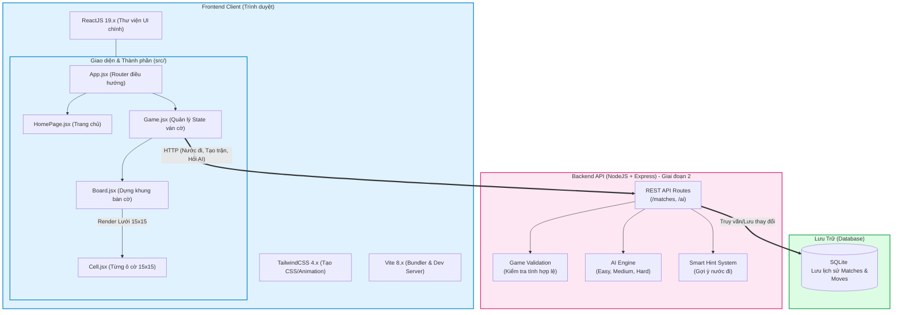

# Sơ đồ Kiến trúc Hệ thống (System Architecture)

Sơ đồ này mô tả chi tiết các thành phần trong hệ thống Gomoku và cách chúng tương tác với nhau, phân chia rõ Frontend (ReactJS), Backend (NodeJS) và Database.
Bạn có thể để file này trong IDE hỗ trợ Markdown (Github, VS Code) để xem trực tiếp dạng hình ảnh, hoặc copy đoạn mã dán vào [Mermaid Live Editor](https://mermaid.live/).

