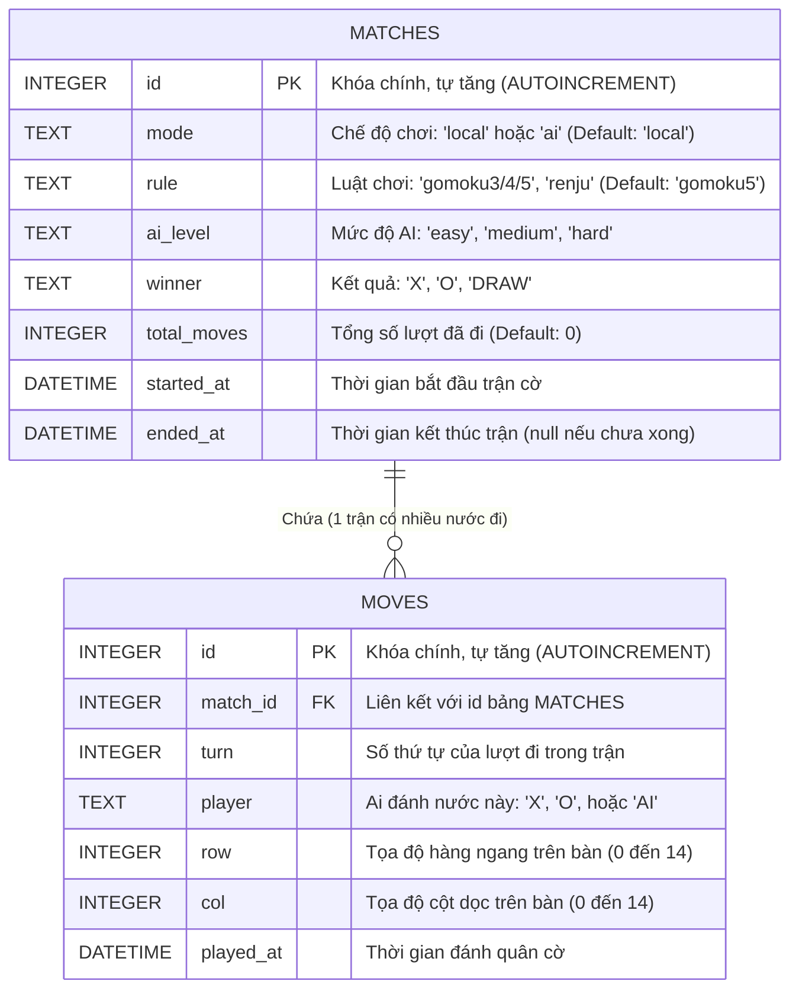

# Sơ đồ Thực thể Liên kết Cơ sở dữ liệu (ERD)

Sơ đồ này mô tả cấu trúc của bảng `matches` và `moves` trong cơ sở dữ liệu SQLite của project Gomoku được thiết kế ở Tuần 28.
Tương tự, có thể preview trực tiếp trong VS Code / Github, hoặc dùng web [Mermaid Live Editor](https://mermaid.live/).

