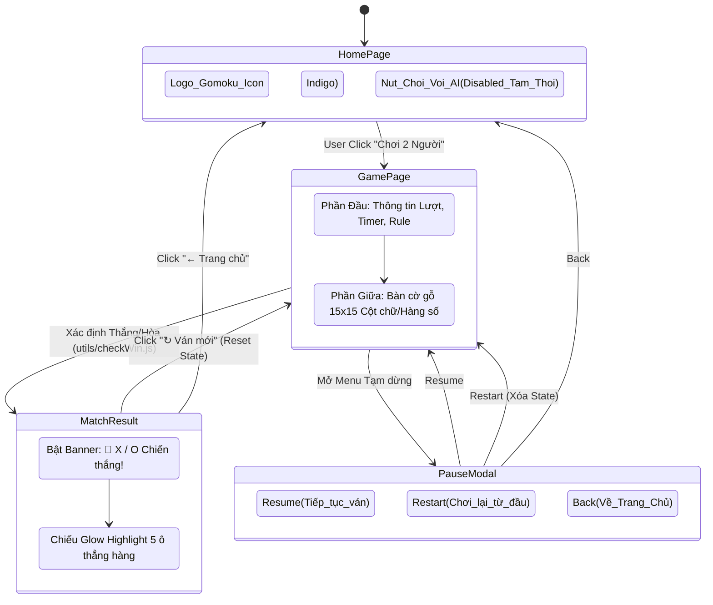

# Sơ đồ Luồng Giao diện (UI/UX Navigation Flow)

Sơ đồ luồng Giao diện giúp Thầy hướng dẫn theo dõi logic chuyển động màn hình dựa theo Code React và Wireframe trong project. 

```mermaid
stateDiagram-v2
    direction TB
    [*] --> HomePage

    state HomePage {
        Logo_Gomoku_Icon
        Nut_Choi_2_Nguoi_Local(Hover:Indigo)
        Nut_Choi_Voi_AI(Disabled_Tam_Thoi)
    }

    HomePage --> GamePage : User Click "Chơi 2 Người"
    
    state GamePage {
        state "Phần Đầu: Thông tin Lượt, Timer, Rule" as Header
        state "Phần Giữa: Bàn cờ gỗ 15x15 Cột chữ/Hàng số" as Board
        
        Header --> Board
    }

    GamePage --> MatchResult : Xác định Thắng/Hòa (utils/checkWin.js)
    
    state MatchResult {
        state "Bật Banner: 🎉 X / O Chiến thắng!" as Win
        state "Chiếu Glow Highlight 5 ô thẳng hàng" as Highlight
        
        Win --> Highlight
    }

    MatchResult --> GamePage : Click "↻ Ván mới" (Reset State)
    MatchResult --> HomePage : Click "← Trang chủ"
    
    GamePage --> PauseModal : Mở Menu Tạm dừng
    
    state PauseModal {
        Resume(Tiếp_tục_ván)
        Restart(Chơi_lại_từ_đầu)
        Back(Về_Trang_Chủ)
    }

    PauseModal --> GamePage : Resume
    PauseModal --> GamePage : Restart (Xóa State)
    PauseModal --> HomePage : Back
```
