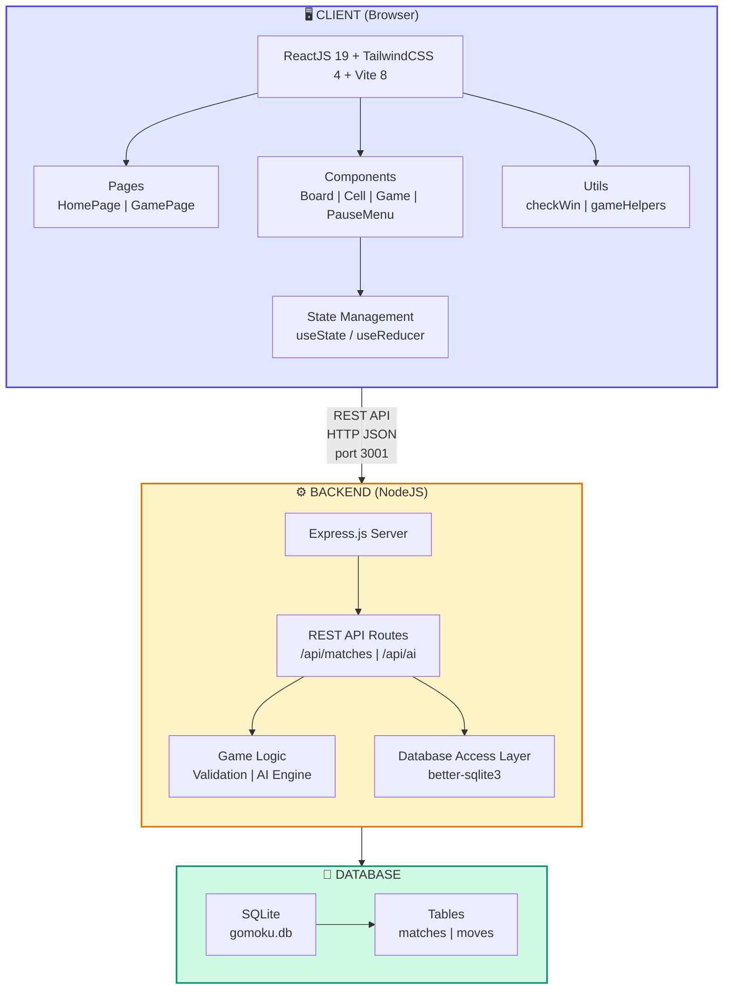
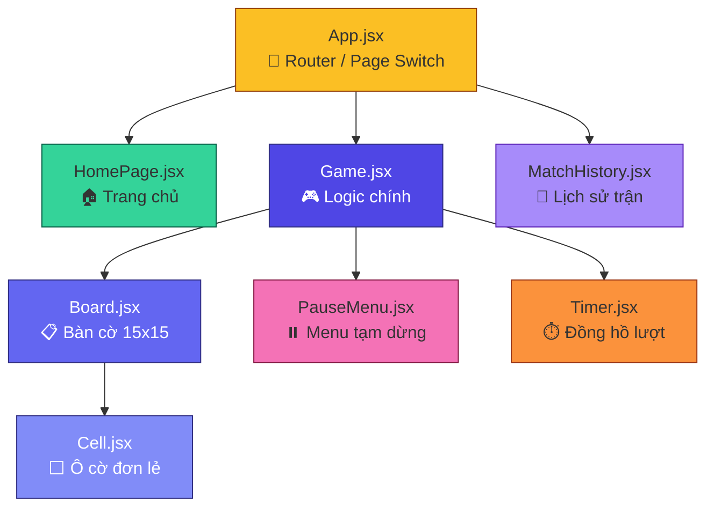
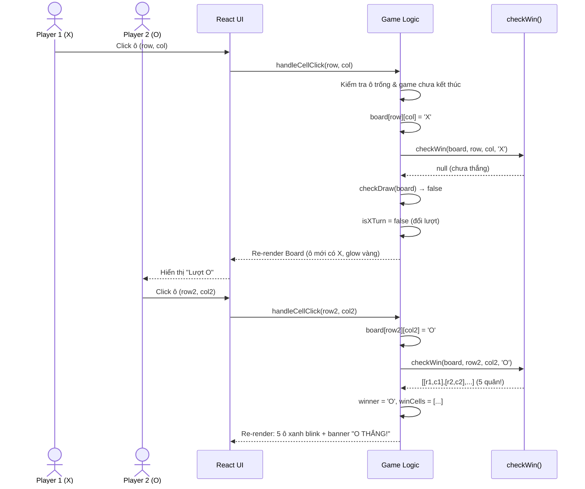
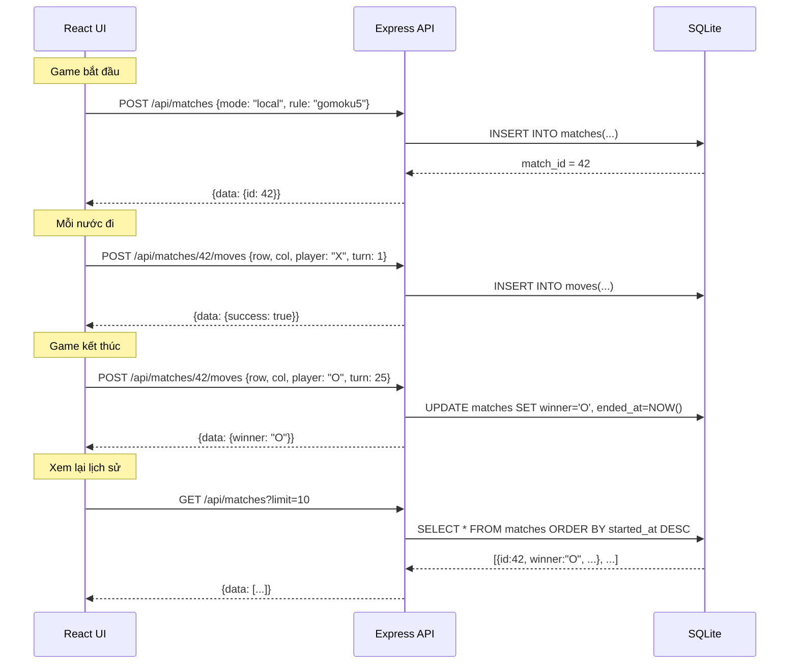
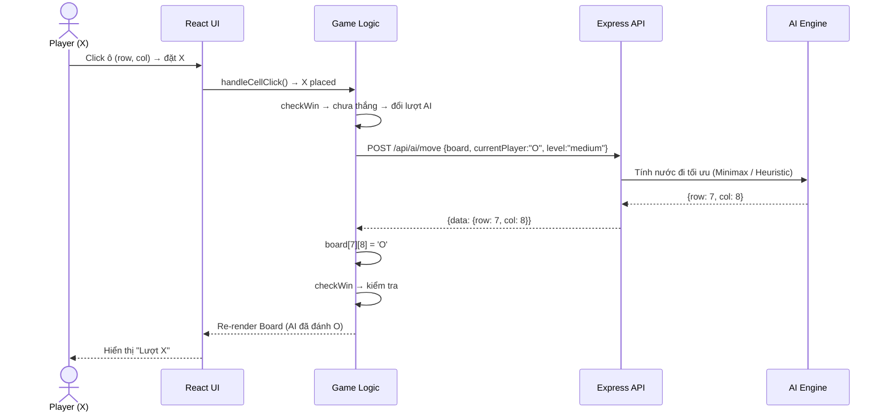
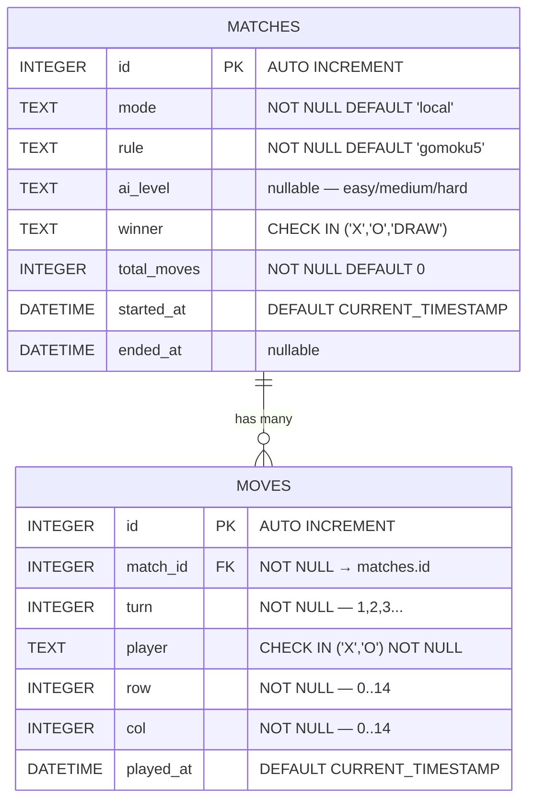

# GOMOKU PROJECT — TÀI LIỆU THIẾT KẾ HỆ THỐNG
## Tuần 28 Deliverables

---

## 1. Kiến trúc hệ thống tổng quan (System Architecture)

### 1.1. Sơ đồ kiến trúc 3 tầng



### 1.2. Mô tả các tầng

| Tầng | Công nghệ | Vai trò | Port |
|------|-----------|---------|------|
| **Frontend** | ReactJS 19 + TailwindCSS 4 + Vite 8 | Hiển thị UI, xử lý logic game client-side, tương tác người dùng | 5173 |
| **Backend** | NodeJS 18+ + Express 4 | REST API, lưu lịch sử, xử lý AI, validate nước đi | 3001 |
| **Database** | SQLite (better-sqlite3) | Lưu trữ kết quả trận đấu, nước đi | File-based |

### 1.3. Nguyên tắc thiết kế

- **Client-first Logic**: Game logic chính (đặt quân, check win) xử lý trên client để không phụ thuộc mạng
- **Backend cho Persistence**: Backend chỉ lưu lịch sử và phục vụ AI, không bắt buộc để chơi
- **Stateless API**: Mỗi request là độc lập, server không giữ session game
- **Progressive Enhancement**: Game hoạt động offline (client-only), backend bổ sung tính năng

---

## 2. Component Diagram (React Frontend)

### 2.1. Cây component



### 2.2. Mô tả Props & State từng component

| Component | Props (nhận vào) | State (nội bộ) | Chức năng |
|-----------|-------------------|-----------------|-----------|
| `App` | — | `currentPage` | Điều hướng giữa các trang |
| `HomePage` | `onStartGame(mode, rule)` | — | Chọn chế độ chơi, luật |
| `Game` | `onBack`, `mode`, `rule` | `board`, `isXTurn`, `lastMove`, `winCells`, `winner`, `isDraw`, `moveCount`, `isPaused`, `timeLeft` | Xử lý toàn bộ logic game |
| `Board` | `board`, `onCellClick`, `lastMove`, `winCells`, `gameOver` | — | Render lưới 15x15 + header |
| `Cell` | `value`, `onClick`, `isLastMove`, `isWinCell`, `disabled` | — | Hiển thị 1 ô (X/O/trống) |
| `PauseMenu` | `onResume`, `onRestart`, `onBack`, `rule`, `timeLeft` | — | Modal pause game |
| `Timer` | `timeLeft`, `isRunning` | — | Hiển thị đếm ngược |
| `MatchHistory` | `onBack` | `matches` (from API) | Danh sách trận đã chơi |

---

## 3. Sequence Diagrams (Luồng dữ liệu)

### 3.1. Use-case: Chơi 2 người (Local) — Đặt quân



### 3.2. Use-case: Lưu lịch sử trận đấu (Milestone 2+)



### 3.3. Use-case: Chơi với AI (Milestone 2+)



---

## 4. Thiết kế Database (ERD)

### 4.1. Entity-Relationship Diagram



### 4.2. Mô tả chi tiết các bảng

#### Bảng `matches` — Lưu thông tin trận đấu

| Cột | Kiểu | Ràng buộc | Mô tả |
|-----|------|-----------|-------|
| `id` | INTEGER | PRIMARY KEY AUTOINCREMENT | Mã trận đấu duy nhất |
| `mode` | TEXT | NOT NULL, DEFAULT 'local' | Chế độ: `'local'` (2 người) hoặc `'ai'` |
| `rule` | TEXT | NOT NULL, DEFAULT 'gomoku5' | Luật: `'gomoku3'`, `'gomoku4'`, `'gomoku5'`, `'renju'` |
| `ai_level` | TEXT | nullable | Mức AI: `'easy'`, `'medium'`, `'hard'` (null nếu local) |
| `winner` | TEXT | CHECK IN ('X','O','DRAW') | Kết quả trận: X thắng, O thắng, hoặc hòa |
| `total_moves` | INTEGER | NOT NULL, DEFAULT 0 | Tổng số nước đi |
| `started_at` | DATETIME | DEFAULT CURRENT_TIMESTAMP | Thời điểm bắt đầu |
| `ended_at` | DATETIME | nullable | Thời điểm kết thúc |

#### Bảng `moves` — Lưu từng nước đi

| Cột | Kiểu | Ràng buộc | Mô tả |
|-----|------|-----------|-------|
| `id` | INTEGER | PRIMARY KEY AUTOINCREMENT | Mã nước đi duy nhất |
| `match_id` | INTEGER | NOT NULL, FK → matches.id | Thuộc trận đấu nào |
| `turn` | INTEGER | NOT NULL | Thứ tự nước đi (1, 2, 3...) |
| `player` | TEXT | NOT NULL, CHECK IN ('X','O') | Ai đánh: X hoặc O |
| `row` | INTEGER | NOT NULL | Hàng (0–14) |
| `col` | INTEGER | NOT NULL | Cột (0–14) |
| `played_at` | DATETIME | DEFAULT CURRENT_TIMESTAMP | Thời điểm đánh |

### 4.3. SQL Schema hoàn chỉnh

```sql
-- =============================================
-- Gomoku Database Schema — SQLite
-- =============================================

-- Bảng lưu trận đấu
CREATE TABLE IF NOT EXISTS matches (
    id           INTEGER PRIMARY KEY AUTOINCREMENT,
    mode         TEXT    NOT NULL DEFAULT 'local',
    rule         TEXT    NOT NULL DEFAULT 'gomoku5',
    ai_level     TEXT,
    winner       TEXT    CHECK(winner IN ('X', 'O', 'DRAW')),
    total_moves  INTEGER NOT NULL DEFAULT 0,
    started_at   DATETIME DEFAULT CURRENT_TIMESTAMP,
    ended_at     DATETIME
);

-- Bảng lưu nước đi
CREATE TABLE IF NOT EXISTS moves (
    id        INTEGER PRIMARY KEY AUTOINCREMENT,
    match_id  INTEGER NOT NULL,
    turn      INTEGER NOT NULL,
    player    TEXT    NOT NULL CHECK(player IN ('X', 'O')),
    row       INTEGER NOT NULL CHECK(row >= 0 AND row <= 14),
    col       INTEGER NOT NULL CHECK(col >= 0 AND col <= 14),
    played_at DATETIME DEFAULT CURRENT_TIMESTAMP,
    FOREIGN KEY (match_id) REFERENCES matches(id) ON DELETE CASCADE
);

-- Indexes cho tối ưu truy vấn
CREATE INDEX IF NOT EXISTS idx_moves_match_turn
    ON moves(match_id, turn);

CREATE INDEX IF NOT EXISTS idx_matches_mode_rule
    ON matches(mode, rule, started_at);

CREATE INDEX IF NOT EXISTS idx_moves_match_id
    ON moves(match_id);
```

### 4.4. Query mẫu

```sql
-- Tạo trận mới
INSERT INTO matches (mode, rule, ai_level) VALUES ('local', 'gomoku5', NULL);

-- Ghi nước đi
INSERT INTO moves (match_id, turn, player, row, col)
VALUES (1, 1, 'X', 7, 7);

-- Kết thúc trận
UPDATE matches
SET winner = 'X', total_moves = 25, ended_at = CURRENT_TIMESTAMP
WHERE id = 1;

-- Lấy lịch sử 10 trận gần nhất
SELECT id, mode, rule, winner, total_moves, started_at, ended_at
FROM matches
ORDER BY started_at DESC
LIMIT 10;

-- Lấy chi tiết trận + tất cả nước đi
SELECT m.*, mov.turn, mov.player, mov.row, mov.col, mov.played_at
FROM matches m
JOIN moves mov ON mov.match_id = m.id
WHERE m.id = 1
ORDER BY mov.turn;

-- Thống kê thắng/thua
SELECT winner, COUNT(*) as count
FROM matches
WHERE winner IS NOT NULL
GROUP BY winner;
```

---

## 5. API Specification

### 5.1. Tổng quan

- **Base URL**: `http://localhost:3001/api`
- **Format**: JSON (`Content-Type: application/json`)
- **Response format**: `{ data: ..., error: null }` hoặc `{ data: null, error: "message" }`

### 5.2. Endpoints chi tiết

---

#### `POST /api/matches` — Tạo trận đấu mới

**Request Body:**
```json
{
    "mode": "local",
    "rule": "gomoku5",
    "ai_level": null
}
```

**Response (201 Created):**
```json
{
    "data": {
        "id": 1,
        "mode": "local",
        "rule": "gomoku5",
        "ai_level": null,
        "winner": null,
        "total_moves": 0,
        "started_at": "2026-03-24T16:00:00.000Z",
        "ended_at": null
    },
    "error": null
}
```

**Validation:**
- `mode` phải là `"local"` hoặc `"ai"`
- `rule` phải là `"gomoku3"`, `"gomoku4"`, `"gomoku5"`, hoặc `"renju"`
- `ai_level` bắt buộc nếu mode = "ai"

---

#### `GET /api/matches` — Danh sách trận đấu

**Query Parameters:**
| Param | Type | Mô tả |
|-------|------|-------|
| `mode` | string | Lọc theo chế độ (optional) |
| `rule` | string | Lọc theo luật (optional) |
| `limit` | number | Giới hạn kết quả, default = 20 |
| `offset` | number | Phân trang, default = 0 |

**Response (200 OK):**
```json
{
    "data": [
        {
            "id": 2,
            "mode": "local",
            "rule": "gomoku5",
            "winner": "X",
            "total_moves": 31,
            "started_at": "2026-03-24T16:30:00.000Z",
            "ended_at": "2026-03-24T16:45:00.000Z"
        }
    ],
    "error": null
}
```

---

#### `GET /api/matches/:id` — Chi tiết trận đấu + moves

**Response (200 OK):**
```json
{
    "data": {
        "match": {
            "id": 1,
            "mode": "local",
            "rule": "gomoku5",
            "winner": "X",
            "total_moves": 5,
            "started_at": "2026-03-24T16:00:00.000Z",
            "ended_at": "2026-03-24T16:10:00.000Z"
        },
        "moves": [
            { "turn": 1, "player": "X", "row": 7, "col": 7, "played_at": "..." },
            { "turn": 2, "player": "O", "row": 7, "col": 8, "played_at": "..." },
            { "turn": 3, "player": "X", "row": 8, "col": 7, "played_at": "..." }
        ]
    },
    "error": null
}
```

**Error (404):**
```json
{ "data": null, "error": "Match not found" }
```

---

#### `POST /api/matches/:id/moves` — Ghi nước đi

**Request Body:**
```json
{
    "row": 7,
    "col": 7,
    "player": "X",
    "turn": 1
}
```

**Response (201 Created):**
```json
{
    "data": {
        "id": 1,
        "match_id": 1,
        "turn": 1,
        "player": "X",
        "row": 7,
        "col": 7,
        "played_at": "2026-03-24T16:00:05.000Z"
    },
    "error": null
}
```

**Validation:**
- Match phải tồn tại và chưa kết thúc
- `row` và `col` phải trong khoảng 0–14
- `player` phải là `"X"` hoặc `"O"`
- Ô (row, col) phải chưa có quân

---

#### `POST /api/ai/move` — AI đánh nước (stub)

**Request Body:**
```json
{
    "board": [["X", null, "O", ...], ...],
    "currentPlayer": "O",
    "level": "easy"
}
```

**Response (200 OK):**
```json
{
    "data": {
        "row": 8,
        "col": 5
    },
    "error": null
}
```

> **Stub (tuần 28–30)**: Level easy trả random ô trống. Medium/Hard sẽ implement từ tuần 31.

---

#### `POST /api/ai/hint` — Gợi ý nước đi (stub)

**Request Body:**
```json
{
    "board": [["X", null, "O", ...], ...],
    "currentPlayer": "X",
    "rule": "gomoku5"
}
```

**Response (200 OK):**
```json
{
    "data": {
        "row": 7,
        "col": 8,
        "reason": "Ô gần quân đã đánh"
    },
    "error": null
}
```

### 5.3. Error Handling

| HTTP Status | Ý nghĩa | Ví dụ |
|-------------|----------|-------|
| 200 | Thành công | GET matches |
| 201 | Tạo thành công | POST match, POST move |
| 400 | Request không hợp lệ | Thiếu field, giá trị sai |
| 404 | Không tìm thấy | Match ID không tồn tại |
| 409 | Conflict | Ô đã có quân, game đã kết thúc |
| 500 | Lỗi server | Database error |

---

## 6. UI Wireframes

### 6.1. Trang Home (HomePage)

```
┌──────────────────────────────────────────────────┐
│          (background: pink gradient)             │
│                                                  │
│              ┌──────────┐                        │
│              │  X  ·  O │                        │
│              │  ·  X  · │     ← Logo 3x3        │
│              │  O  ·  X │                        │
│              └──────────┘                        │
│                                                  │
│              G O M O K U                         │
│       Cờ Caro - Năm quân để thắng               │
│                                                  │
│    ┌────────────────────────────────┐             │
│    │  👥 Chơi 2 Người (Local)      │  ← Button  │
│    └────────────────────────────────┘             │
│                                                  │
│    ┌────────────────────────────────┐             │
│    │  🤖 Chơi với AI               │  ← Disabled │
│    │     Sắp ra mắt - Milestone 2  │             │
│    └────────────────────────────────┘             │
│                                                  │
│    ┌────────────────────────────────┐             │
│    │  📜 Lịch sử trận đấu         │  ← Disabled │
│    │     Sắp ra mắt                │             │
│    └────────────────────────────────┘             │
│                                                  │
│          © 2026 Gomoku Game                      │
└──────────────────────────────────────────────────┘
```

### 6.2. Trang Game

```
┌──────────────────────────────────────────────────┐
│  [← Trang chủ]      ⚔️ GOMOKU      [⏸ Pause]   │
│                                                  │
│  ┌──────────────┐    VS    ┌──────────────┐      │
│  │ X Player 1   │         │ O Player 2    │      │
│  │ ⬤ active     │         │   inactive    │      │
│  └──────────────┘         └──────────────┘      │
│                                                  │
│              ⏱️ 00:25 (timer lượt)               │
│                                                  │
│  🎉 Người chơi 1 (X) CHIẾN THẮNG!  ← khi thắng │
│                                                  │
│  Nước đi: 25        Luật: Gomoku-5               │
│                                                  │
│     A  B  C  D  E  F  G  H  I  J  K  L  M  N  O │
│  1 ┌──┬──┬──┬──┬──┬──┬──┬──┬──┬──┬──┬──┬──┬──┬──┐│
│  2 ├──┼──┼──┼──┼──┼──┼──┼──┼──┼──┼──┼──┼──┼──┼──┤│
│  3 ├──┼──┼──┤X ├──┼──┼──┼──┼──┼──┼──┼──┼──┼──┼──┤│
│  . ├──┼──┼──┼──┤O ├──┼──┼──┼──┼──┼──┼──┼──┼──┼──┤│
│  . │                  ...                        ││
│ 15 └──┴──┴──┴──┴──┴──┴──┴──┴──┴──┴──┴──┴──┴──┴──┘│
│                                                  │
│         Gomoku - Project II                      │
└──────────────────────────────────────────────────┘
```

### 6.3. Pause Menu (Modal)

```
┌──────────────────────────────────────────────────┐
│                                                  │
│  (overlay tối mờ phía sau)                       │
│                                                  │
│      ┌────────────────────────────────┐           │
│      │                                │           │
│      │       ⏸️ GAME PAUSED          │           │
│      │                                │           │
│      │   Luật: Gomoku-5              │           │
│      │   Nước đi: 15                 │           │
│      │   Thời gian: 05:23            │           │
│      │                                │           │
│      │   ┌────────────────────┐      │           │
│      │   │  ▶ Resume          │      │           │
│      │   └────────────────────┘      │           │
│      │   ┌────────────────────┐      │           │
│      │   │  ↻ Restart         │      │           │
│      │   └────────────────────┘      │           │
│      │   ┌────────────────────┐      │           │
│      │   │  ⌂ Back to Home   │      │           │
│      │   └────────────────────┘      │           │
│      │                                │           │
│      └────────────────────────────────┘           │
│                                                  │
└──────────────────────────────────────────────────┘
```

---

## 7. Thiết kế UX & Color System

### 7.1. Bảng màu chính

| Thành phần | Màu | HEX | Mục đích |
|------------|-----|-----|----------|
| Background | Pink gradient | `#fdf2f8` → `#fce7f3` → `#fbcfe8` | Nền tổng thể, tone hồng nhẹ |
| Quân X | Pink-600 | `#db2777` | Quân người chơi 1 |
| Quân O | Pink-500 | `#ec4899` | Quân người chơi 2, tương phản nhẹ |
| Nước đi cuối | Yellow-100 + pulse glow | `#fef9c3` | Nhấn mạnh nước vừa đánh |
| Ô thắng | Green-200 + blink | `#bbf7d0` | Rõ ràng khi kết thúc |
| Bàn cờ | Amber-50 | `#fffbeb` | Nền gỗ nhạt, giống bàn cờ |
| Text chính | Pink-900 | `#831843` | Text trên nền sáng |
| Button chính | Pink-600 | `#db2777` | CTA buttons |

### 7.2. Animation Guidelines

| Animation | Duration | Timing | Mục đích |
|-----------|----------|--------|----------|
| `pop` | 0.25s | ease-out | Quân cờ xuất hiện (scale 0→1.2→1) |
| `pulse-glow` | 1.5s | infinite | Nước đi cuối nhấp nháy nhẹ |
| `win-blink` | 0.8s | infinite | 5 quân thắng blink |
| `fade-in` | 0.5s | ease-out | Banner kết quả, page transitions |

### 7.3. Responsive Design

| Breakpoint | Bàn cờ | Font size | Layout |
|------------|--------|-----------|--------|
| Mobile (< 640px) | Scroll ngang | `text-lg` | Stack dọc |
| Tablet (640–1024px) | Vừa màn hình | `text-xl` | Stack dọc, rộng hơn |
| Desktop (> 1024px) | Full size | `text-2xl` | Sidebar (tương lai) |

---

## 8. Cấu trúc thư mục tổng thể (Tuần 28–30)

```
gomoku/
├── docs/
│   └── system-design.md          ← TÀI LIỆU NÀY
├── server/                        ← BACKEND (tuần 29)
│   ├── package.json
│   ├── index.js                   ← Express server entry
│   ├── db/
│   │   ├── schema.sql             ← SQL migration
│   │   ├── database.js            ← DB connection + init
│   │   └── gomoku.db              ← SQLite file (auto-gen)
│   └── routes/
│       ├── matches.js             ← CRUD matches + moves
│       └── ai.js                  ← AI stubs
├── src/                           ← FRONTEND (đã có)
│   ├── App.jsx
│   ├── main.jsx
│   ├── index.css
│   ├── components/
│   │   ├── Board.jsx
│   │   ├── Cell.jsx
│   │   └── Game.jsx
│   ├── pages/
│   │   └── HomePage.jsx
│   └── utils/
│       └── checkWin.js
├── index.html
├── package.json
├── vite.config.js
├── doc.md
└── ĐỀ XUẤT ĐỀ TÀI PROJECT II.txt
```
